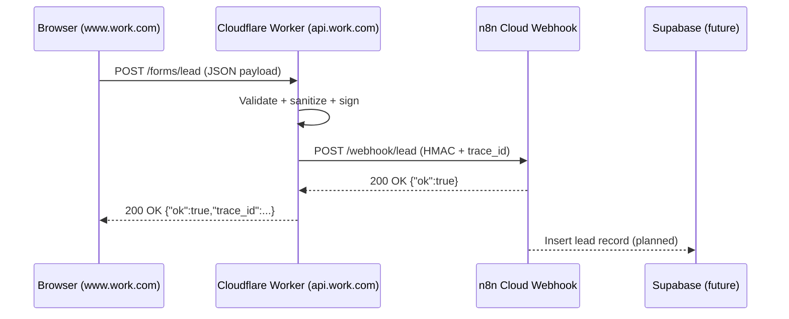

# Lead Intake Pipeline — Architecture Summary

## 1. Purpose

This document defines the production-grade lead intake pipeline connecting client-facing forms to the automation backend.
It ensures secure, observable, and repeatable data flow from the **frontend (Cloudflare Pages)** through **Cloudflare Workers** to **n8n Cloud**, with planned integration to **Supabase**.

---

## 2. System Overview

| Layer          | Technology                            | Function                                             |
| -------------- | ------------------------------------- | ---------------------------------------------------- |
| **Frontend**   | Astro (deployed via Cloudflare Pages) | Captures user input and submits JSON via `fetch()`   |
| **Edge**       | Cloudflare Worker (`lead-proxy`)      | Validates, signs, and forwards data securely         |
| **Automation** | n8n Cloud                             | Executes workflows, processes leads, and stores data |
| **Database**   | Supabase (planned)                    | Persists validated lead records                      |
| **Monitoring** | GitHub Actions / n8n Cron (planned)   | Nightly synthetic test for system health             |

**Production environment:** Fully cloud-managed
**R&D environment:** VPS (Dockerized sandbox for testing only)

---

## 3. Data Flow Summary

---

## 4. Cloudflare Worker — Functional Specification

### Core Role

Acts as the **edge router and security gate** between the public internet and n8n Cloud.

### Request Handling

| Method    | Route         | Description                     |
| --------- | ------------- | ------------------------------- |
| `OPTIONS` | `/forms/lead` | Responds to CORS preflight      |
| `POST`    | `/forms/lead` | Processes validated submissions |
| `GET`     | `/health`     | Health-check endpoint (200 OK)  |
| Any other | —             | Returns `404 Not Found`         |

### Validation Logic

| Step            | Rule                                  | Response on Failure          |
| --------------- | ------------------------------------- | ---------------------------- |
| Origin check    | Allowlist: `www.work.com`, `hayai.cc` | 403 `origin_not_allowed`     |
| Content-Type    | Must be `application/json`            | 415 `unsupported_media_type` |
| Payload size    | Max 64 KB                             | 413 `payload_too_large`      |
| JSON parse      | Must be valid JSON                    | 400 `invalid_json`           |
| Required fields | `name`, `email`                       | 400 `missing_field`          |
| Email format    | Must include `@`                      | 400 `invalid_email`          |

### Security Features

* **HMAC Signature:** Signs JSON body with `SIGNING_SECRET`; included in `X-Signature` header.
* **Trace ID:** Ensures unique tracking per request; generated if missing.
* **Timeout:** 5 s limit on n8n response; fails gracefully with 502.
* **CORS:** Only whitelisted origins accepted for both preflight and real requests.

---

## 5. DNS & Routing Configuration

| Record        | Type        | Target                        | Notes                             |
| ------------- | ----------- | ----------------------------- | --------------------------------- |
| `www`         | CNAME       | `<pages>.pages.dev`           | Public website (Cloudflare Pages) |
| `api`         | A (proxied) | Placeholder `192.0.2.1`       | Bound to Worker route             |
| Route Binding | —           | `api.work.com/* → lead-proxy` | Connects subdomain to Worker      |

All records have **proxy enabled (orange cloud)** to ensure Cloudflare edge interception.

---

## 6. Security Posture

| Threat                    | Mitigation              |
| ------------------------- | ----------------------- |
| Unauthorized origins      | Origin allowlist        |
| Junk or bot traffic       | Payload validation      |
| Oversized data            | 64 KB size cap          |
| Tampered payloads         | HMAC signature          |
| Slow or offline backend   | Timeout + safe fallback |
| Missing traceability      | Auto trace ID           |
| Replay or abuse (planned) | KV rate limiting        |

---

## 7. Verification Summary

| Test                  | Result                              |
| --------------------- | ----------------------------------- |
| Preflight OPTIONS     | ✅ Returns `204` with CORS headers   |
| POST (valid JSON)     | ✅ Returns `200 {"ok":true}`         |
| n8n webhook execution | ✅ Logged and processed successfully |
| Timeout test          | ✅ Worker returns 502 gracefully     |
| Invalid origin        | ✅ Returns `403 origin_not_allowed`  |

**Outcome:** All tests passed.
System is stable, secure, and production-ready.

---

## 8. Next Steps

| Stage | Task                                                          | Owner                     | Priority |
| ----- | ------------------------------------------------------------- | ------------------------- | -------- |
| 1     | Integrate Supabase for persistent storage                     | n8n Workflow              | High     |
| 2     | Add rate limiting (KV-based)                                  | Cloudflare Worker         | Medium   |
| 3     | Implement HMAC verification node                              | n8n Workflow              | High     |
| 4     | Create nightly synthetic test                                 | GitHub Actions / n8n Cron | Medium   |
| 5     | Add `/docs/workflows/lead_proxy.md` (auto-generated by Codex) | Codex                     | Medium   |

---

## 9. Failure & Recovery Model

| Component | Failure Mode                     | Recovery Path                                   |
| --------- | -------------------------------- | ----------------------------------------------- |
| Worker    | Deployment error or config issue | Re-deploy via Wrangler or revert version        |
| n8n       | Cloud outage                     | Queue retries; manual resubmit from Worker logs |
| Supabase  | Network or auth failure          | Queue locally (KV store) until restored         |
| Frontend  | DNS misconfiguration             | Restore record in Cloudflare DNS panel          |

---

## 10. Compliance Notes

* No user credentials or PII stored at the edge.
* HMAC signing ensures integrity; no secret exposed client-side.
* Supabase will use **service role key** in n8n (server-side only).
* All data paths are HTTPS end-to-end.

---

## 11. Status Summary

| Layer                | State      | Last Verified |
| -------------------- | ---------- | ------------- |
| Frontend → Worker    | ✅ Working  | 2025-11-07    |
| Worker → n8n Cloud   | ✅ Working  | 2025-11-07    |
| CORS & Security      | ✅ Verified | 2025-11-07    |
| Supabase Integration | 🚧 Pending | —             |
| Rate Limiting        | ⚙️ Planned | —             |
| Synthetic Monitoring | ⚙️ Planned | —             |

---

**Last Update:** 2025-11-07
**Version:** v1.0
